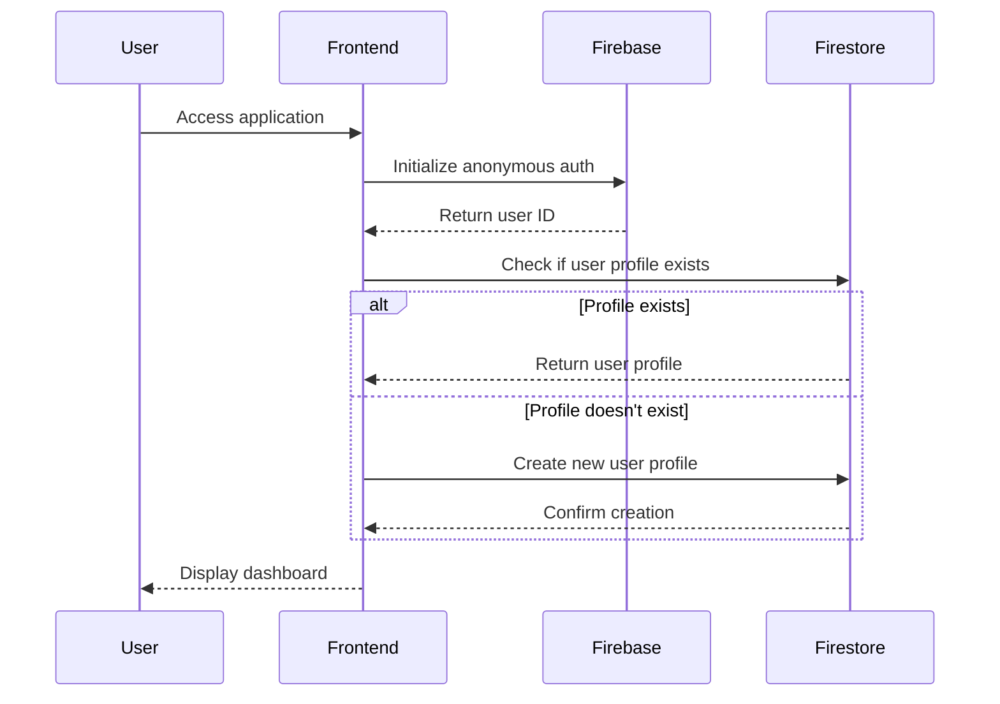
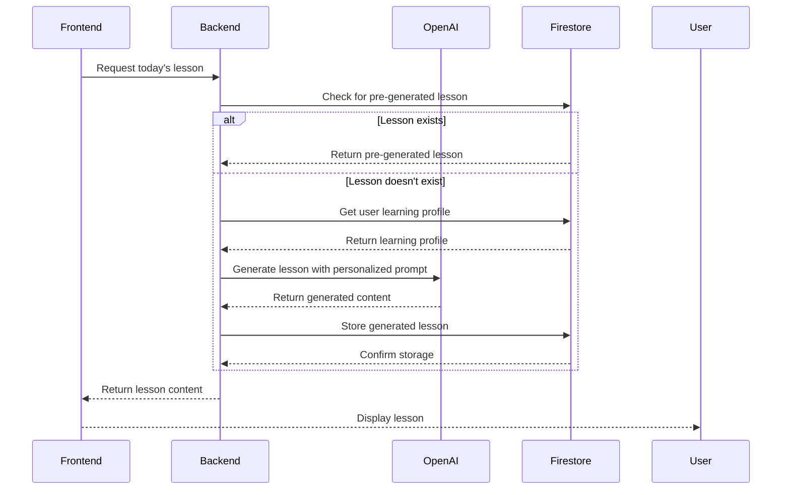
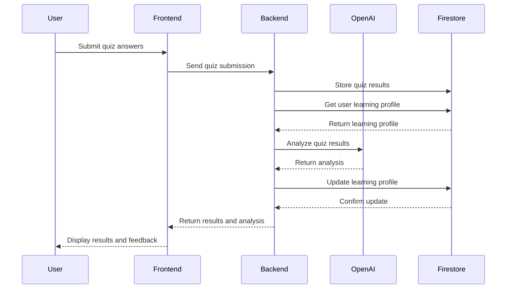
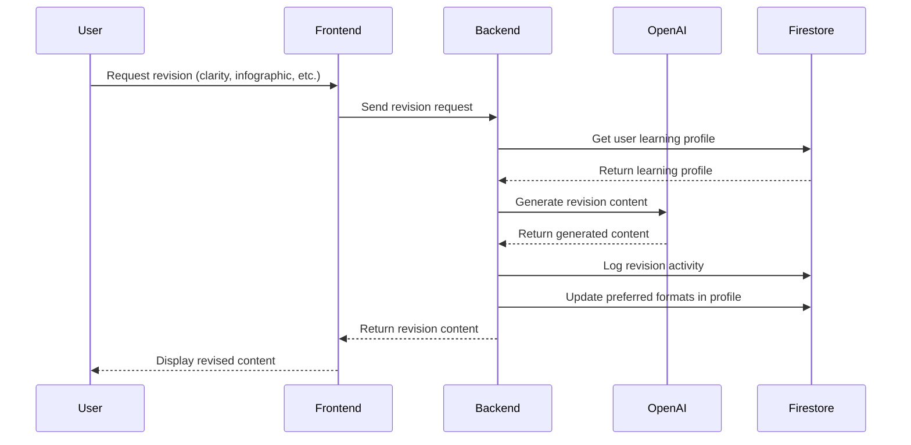

# Technical Architecture for DCIO/Tech Exam Preparation Platform

This document outlines the technical architecture of the AI-Powered DCIO/Tech Exam Preparation Platform, detailing the technology stack, component interactions, and data flow.

## System Overview

The DCIO/Tech Exam Preparation Platform is a web application designed as a personalized, single-user learning assistant powered by an intelligent AI Agent. The architecture follows a client-server model with a React frontend, FastAPI backend, Firebase/Firestore database, and OpenAI integration.

## Technology Stack

### Frontend
- **Framework**: React with TypeScript
- **Styling**: Tailwind CSS
- **State Management**: React Context API
- **Build Tool**: Vite
- **Key Libraries**:
  - `react-router-dom` for routing
  - `react-markdown` for rendering lesson content
  - `lucide-react` for icons
  - `react-query` for data fetching and caching

### Backend
- **Framework**: FastAPI (Python)
- **API Documentation**: Swagger UI (built into FastAPI)
- **Key Libraries**:
  - `pydantic` for data validation
  - `firebase-admin` for Firestore integration
  - `openai` for OpenAI API integration
  - `uvicorn` for ASGI server

### Database
- **Primary Database**: Firebase Firestore
- **Data Structure**: NoSQL document-based
- **Authentication**: Firebase Authentication (anonymous auth for single user)

### AI Integration
- **LLM Provider**: OpenAI GPT-4
- **Image Generation** (optional): DALL-E 3
- **Text-to-Speech** (optional): Web Speech API or external TTS service

## Component Architecture

### Frontend Components

```
frontend/
├── src/
│   ├── components/
│   │   ├── Dashboard/
│   │   │   ├── Dashboard.tsx
│   │   │   ├── DailyLessonCard.tsx
│   │   │   └── PerformanceSummary.tsx
│   │   ├── LessonViewer/
│   │   │   ├── LessonViewer.tsx
│   │   │   ├── ContentActions.tsx
│   │   │   └── QuizSection.tsx
│   │   ├── QuizManager/
│   │   │   ├── QuizManager.tsx
│   │   │   ├── QuizQuestion.tsx
│   │   │   └── QuizResults.tsx
│   │   ├── RevisionHub/
│   │   │   ├── RevisionHub.tsx
│   │   │   ├── TopicCard.tsx
│   │   │   └── SprintConfigurator.tsx
│   │   ├── FormulaBuilder/
│   │   │   ├── FormulaSheet.tsx
│   │   │   ├── FAQBooklet.tsx
│   │   │   └── ReferenceEntry.tsx
│   │   ├── Layout/
│   │   │   ├── Layout.tsx
│   │   │   ├── Navbar.tsx
│   │   │   └── Sidebar.tsx
│   │   └── Onboarding/
│   │       ├── WelcomePage.tsx
│   │       └── LearningStyleDiagnostic.tsx
│   ├── contexts/
│   │   ├── AuthContext.tsx
│   │   ├── LearningProfileContext.tsx
│   │   └── UIContext.tsx
│   ├── services/
│   │   ├── backendService.ts
│   │   ├── firestoreService.ts
│   │   └── openaiService.ts
│   ├── types/
│   │   └── index.ts
│   ├── utils/
│   │   ├── formatters.ts
│   │   └── validators.ts
│   ├── App.tsx
│   └── main.tsx
```

### Backend Components

```
backend/
├── main.py                # FastAPI application and routes
├── openai_service.py      # OpenAI API integration
├── firestore_service.py   # Firestore database operations
├── models.py              # Pydantic models for request/response validation
├── utils.py               # Utility functions
└── requirements.txt       # Python dependencies
```

## Data Flow Architecture

### 1. Authentication Flow



### 2. Daily Lesson Generation Flow



### 3. Quiz Submission Flow



### 4. On-Demand Revision Flow



## Database Schema

### Firestore Collections

1. **Learning Profile**
   ```
   /artifacts/{appId}/users/{userId}/learning_profile/profile
   ```
   - `strengths`: Map<string, number> (topic_id: confidence_score)
   - `weaknesses`: Map<string, number> (topic_id: performance_score)
   - `learning_pace`: number
   - `preferred_formats`: Map<string, number>
   - `difficulty_adjustment`: number
   - `progress_map`: Map<string, any>
   - `daily_streak`: number
   - `total_study_time`: number
   - `last_active_date`: timestamp

2. **Lessons**
   ```
   /artifacts/{appId}/users/{userId}/lessons/{lessonId}
   ```
   - `topic_id`: string
   - `title`: string
   - `content_text`: string
   - `mcqs_json`: string (JSON string of MCQs)
   - `summary_text`: string
   - `generated_at`: timestamp
   - `type`: string (e.g., "daily_lesson", "clarity_revision")

3. **Quizzes**
   ```
   /artifacts/{appId}/users/{userId}/quizzes/{quizId}
   ```
   - `lesson_id`: string
   - `topic_id`: string
   - `questions_attempted_json`: string
   - `score`: number
   - `correct_answers_count`: number
   - `incorrect_answers_count`: number
   - `time_taken_seconds`: number
   - `submitted_at`: timestamp

4. **Revision Logs**
   ```
   /artifacts/{appId}/users/{userId}/revision_logs/{logId}
   ```
   - `topic_id`: string
   - `revision_type`: string
   - `timestamp`: timestamp
   - `content_generated`: boolean

5. **Formula Sheets**
   ```
   /artifacts/{appId}/users/{userId}/formula_sheets/{formulaId}
   ```
   - `topic_id`: string
   - `formula_text`: string
   - `is_difficult`: boolean
   - `added_at`: timestamp

6. **FAQ Booklet**
   ```
   /artifacts/{appId}/users/{userId}/faq_booklet/{faqId}
   ```
   - `topic_id`: string
   - `question`: string
   - `answer`: string
   - `source_query`: string
   - `added_at`: timestamp

## API Endpoints

### Learning Profile Endpoints
- `GET /api/learning-profile/{app_id}/{user_id}`: Get the user's learning profile
- `POST /api/learning-profile/{app_id}/{user_id}`: Update the user's learning profile

### Analytics Endpoints
- `POST /api/analytics/quiz-submission/{app_id}/{user_id}`: Submit quiz answers and update the learning profile
- `POST /api/analytics/topic-interaction/{app_id}/{user_id}`: Track topic interactions and update the learning profile

### Lesson Endpoints
- `GET /api/lessons/today`: Get today's pre-generated lesson
- `POST /api/lessons/generate`: Generate a lesson for a specific topic

### Revision Endpoints
- `POST /api/revision/generate`: Generate revision content

### Formula Sheet Endpoints
- `POST /api/formula-sheet/add/{app_id}/{user_id}`: Add a formula entry to the user's formula sheet
- `GET /api/formula-sheet/{app_id}/{user_id}`: Get formula entries from the user's formula sheet

### FAQ Endpoints
- `POST /api/faq-booklet/add/{app_id}/{user_id}`: Add an FAQ entry to the user's FAQ booklet
- `GET /api/faq-booklet/{app_id}/{user_id}`: Get FAQ entries from the user's FAQ booklet

## Security Considerations

1. **API Key Protection**: OpenAI API keys are stored securely on the backend and never exposed to the frontend.

2. **Firebase Security Rules**: Firestore security rules ensure that only the authenticated user can access their own data:
   ```
   service cloud.firestore {
     match /databases/{database}/documents {
       match /artifacts/{appId}/users/{userId}/{document=**} {
         allow read, write: if request.auth != null && request.auth.uid == userId;
       }
     }
   }
   ```

3. **CORS Configuration**: The backend API restricts cross-origin requests to trusted domains.

4. **Input Validation**: All API inputs are validated using Pydantic models to prevent injection attacks.

## Performance Considerations

1. **Caching Strategy**:
   - Use React Query for frontend data caching
   - Implement server-side caching for OpenAI responses
   - Cache frequently accessed Firestore documents

2. **Lazy Loading**:
   - Implement code splitting for React components
   - Lazy load images and non-critical resources

3. **Optimistic UI Updates**:
   - Update UI immediately for user actions, then confirm with backend

4. **Firestore Optimization**:
   - Use efficient queries with appropriate indexes
   - Minimize document reads and writes
   - Implement pagination for large collections

## Deployment Architecture

### Development Environment
- Frontend: Vite dev server
- Backend: Uvicorn development server
- Database: Firebase Firestore (development project)

### Production Environment
- Frontend: Static hosting (Firebase Hosting, Vercel, or Netlify)
- Backend: Cloud Run, AWS Lambda, or similar serverless platform
- Database: Firebase Firestore (production project)

## Monitoring and Logging

1. **Error Tracking**:
   - Implement error boundary in React
   - Set up server-side error logging
   - Track OpenAI API errors

2. **Performance Monitoring**:
   - Monitor API response times
   - Track Firestore usage
   - Monitor OpenAI API usage

3. **Usage Analytics**:
   - Track user engagement metrics
   - Monitor feature usage
   - Analyze content generation patterns

## Future Scalability Considerations

1. **Multi-User Support**:
   - Enhance authentication system
   - Implement user management
   - Add data isolation between users

2. **Content Caching**:
   - Implement a caching layer for common content
   - Reduce OpenAI API calls for similar requests

3. **Offline Support**:
   - Implement service workers
   - Add offline data synchronization
   - Cache essential content for offline access

4. **Advanced AI Features**:
   - Integrate DALL-E for image generation
   - Add speech-to-text for voice input
   - Implement more sophisticated learning analytics
